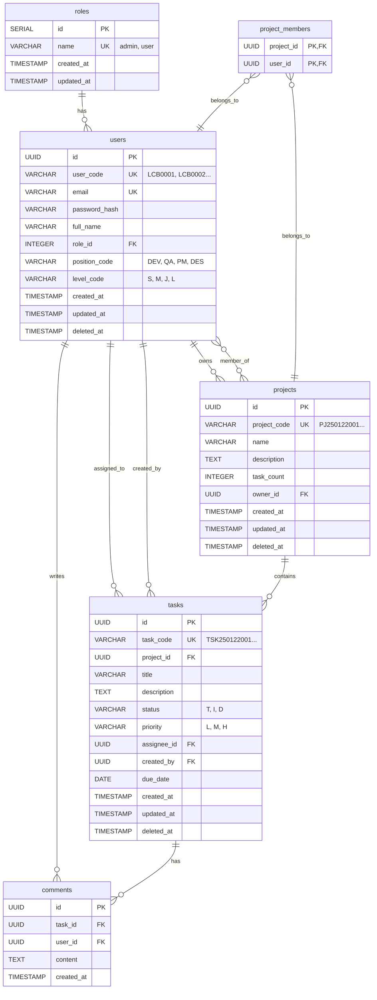

# ER-Diagram: Jira Mini

## Database Schema

## Tables Overview

| Table | Description |
|-------|-------------|
| **roles** | User roles (admin, user) |
| **users** | User accounts with position and level |
| **projects** | Projects with owner and task count |
| **project_members** | Many-to-many: Users assigned to Projects |
| **tasks** | Tasks with status, priority, and assignee |
| **comments** | Comments on tasks |

## Relationships

| From | To | Type | Description |
|------|-----|------|-------------|
| users | roles | Many-to-One | User has one role |
| projects | users | Many-to-One | Project has one owner |
| project_members | projects | Many-to-One | Junction table |
| project_members | users | Many-to-One | Junction table |
| tasks | projects | Many-to-One | Task belongs to project |
| tasks | users (assignee) | Many-to-One | Task assigned to user |
| tasks | users (created_by) | Many-to-One | Task created by user |
| comments | tasks | Many-to-One | Comment on task |
| comments | users | Many-to-One | Comment by user |

## Code Formats

| Entity | Format | Example |
|--------|--------|---------|
| User Code | `LCB` + 4 digits | LCB0001, LCB0002 |
| Project Code | `PJ` + YYMMDD + 3 digits | PJ250122001 |
| Task Code | `TSK` + YYMMDD + 3 digits | TSK250122001 |

## Status & Priority Codes

### Task Status
| Code | Description |
|------|-------------|
| T | Todo |
| I | In Progress |
| D | Done |

### Task Priority
| Code | Description |
|------|-------------|
| L | Low |
| M | Medium |
| H | High |

### Position Codes
| Code | Description |
|------|-------------|
| DEV | Developer |
| QA | Quality Assurance |
| PM | Project Manager |
| DES | Designer |

### Level Codes
| Code | Description |
|------|-------------|
| S | Senior |
| M | Middle |
| J | Junior |
| L | Lead |
